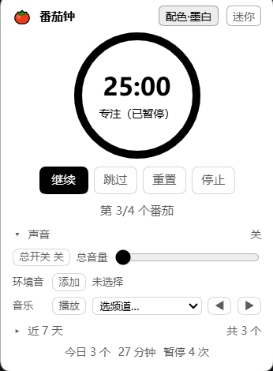
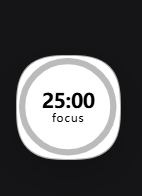

# dsh-pomodoro-ai

An **AI pomodoro timer** plugin for [DeepSeek Harness](https://github.com/deepseek-ai) (DSH).

One global timer + one session-scoped "manager" + a floating widget inside the DSH window.
Hand a task to the AI in your manager session and it splits the work, estimates pomodoros,
schedules them and starts the timer; when a phase ends it comes back to you on its own.
**Every other session cannot even see the pomodoro tools** — while you work on other projects,
no second AI can touch your clock.

[中文](README.md)

<p align="center">
  
  &nbsp;&nbsp;
  
</p>

---

## What it solves

- **You don't want to babysit a timer**: say "break down today's work and start the first pomodoro" —
  the AI registers the plan, estimates pomodoros, starts the first one, and you go work.
- **You run many sessions on many projects**: the pomodoro belongs to exactly one session you designate.
  Other sessions don't even carry the tool schemas in their requests (which also saves tokens),
  and a forced call only ever returns `UNKNOWN_TOOL`.
- **You want an honest record**: when a pause happened, how long it lasted, and which phase
  completed while the machine was off (explicitly flagged as unverifiable) — all appended to an event log.
  Statistics aggregate by **local calendar day**.
- **You don't want to be held hostage by notifications**: a phase end notifies once, delivered into the
  manager session, and the AI arrives with authoritative state (real duration, pause count and timestamps)
  instead of an empty chime.

## Features

| Capability | Notes |
|---|---|
| AI tool surface | `pomodoro_plan` / `start` / `control` / `status` / `noise` — **visible only to the manager session** |
| Round model | `focus → short break → … → long break` (every N rounds); short/long breaks independently toggleable |
| Floating widget | Draggable overlay in the DSH window; expanded view has plan / sound / weekly panels; mini view is a single "burning down" ring + time + a tiny `focus`/`relax` label |
| Ambient audio | FlowTunes ambient loops, **multiple simultaneously**, each with its own volume; plus music channels (sequential) or a local folder |
| Cues | Three completion cues (focus / short break / long break) plus an optional ticking sound |
| Weekly stats | 7-day bar chart and today's totals, split by local calendar day |
| Proactive at phase end | Delivered as a **follow-up turn in that session** via the official `@deepseek-ai/dsh-schedule` |
| Nothing gets lost | Absolute `deadlineAt`: refreshing the page or closing the window doesn't matter; after a restart the reminder is re-armed with the remaining time |
| State migration | Versioned `state.json` migration (currently v3), lossless from older versions |

## Install

```powershell
# 1) Install the plugin (official CLI, from GitHub)
dsh plugin --profile desktop add github:dragonheartcra/dsh-pomodoro-ai

# 2) Add the official persistent reminder service to your profile
#    Edit ~/.dsh/profiles/desktop/cordis.patch.yml and append:
#      - insert:
#          - id: schedule
#            name: '@deepseek-ai/dsh-schedule'
```

Restart DSH (or enable official HMR to skip restarts) and the widget appears in the bottom-right corner.

> No build step and no runtime dependencies: `lib/*.js` is the shipped artifact, and the only `require`
> is `react`.

## Usage

### 1. Designate a session as the "manager"

Type this in the session you want to manage the pomodoro:

```text
/pomodoro 接管      # claim: this session becomes the manager (others instantly lose visibility)
/pomodoro 释放      # release
/pomodoro           # status: who is the manager, where the tools are mounted, timer state
```

Alias: `/pomo`. (Command names must be ASCII — the official registry enforces `^[a-z][a-z0-9_-]*$`.)

### 2. Talk to the AI in the manager session

```text
Break down today's work and start the first pomodoro
How much time is left, and how long have I focused today?
Change focus to 45 minutes, long break every 2 rounds
Put on some rain and campfire, lower the volume
```

### 3. The widget

- **Expanded**: ring + time + phase; four buttons (pause/resume, skip, reset, stop); three collapsible
  panels (plan, sound, last 7 days); today's totals at the bottom.
- **Mini**: a **single circle** — the ring burns down over time, the time sits in the middle, and a tiny
  label below reads `focus` / `relax` (both breaks say `relax`; the ring color distinguishes short vs long).
  **Click to expand**, drag to move.
- The header has a "配色" (theme) button cycling four self-contained palettes: auto / ink / dark / light.

## Session isolation (the manager session)

**Why**: DSH runs many projects at once, and only one session should manage the pomodoro.
Globally registered tools cost you three things — every session's request carries five tool schemas
(you pay tokens for nothing), any session can steal the binding via `pomodoro_start`, and any session
can operate the single global clock.

**How**: the tools are **not registered globally**; they are registered into the manager session's agent scope.

| Layer | Location | Notes |
|---|---|---|
| Clock / state / event log / HTTP routes / widget data | global | One thing at a time — a singleton is the correct semantic |
| Phase-end reminder | global, delivered to the **manager session** | `reminderTarget = manager ?? watch` |
| The five tools | **the manager session's `agent.ctx`** | invisible everywhere else |
| Designating the manager | the human command `/pomodoro 接管` | `invocation.agent` is the invoking session |

Official basis (exact contracts from `cordis_inspect_query`, not guesswork):

- `tools.register()`: *"Register globally **or in the calling agent scope**"*
- `tools.schemas(scope?)` / `get(name, scope?)`: *"the viewing scope (**the agent**)"*
- `tools.execute()`: *"an **invisible** tool reports `UNKNOWN_TOOL`"*
- Event `agent/created` (serial): *"ready for **per-agent initialization**"* → tools are re-mounted when a session is reopened
- Command `handler(invocation)`: `invocation.agent` is the session that typed the command

**Three gates**:

1. `assertToolSchema` — validated before registration (an empty `parameters` is rejected by the upstream
   with a 400 and **breaks every session in the app**; we've been there)
2. `register` into the manager scope
3. **Read-back isolation check**: the manager scope has all five tools **and the global view has none**;
   otherwise the whole mount is rolled back

Plus a second gate inside every tool's `execute` (non-manager sessions are rejected) and a **reconciler**
that runs every 15 seconds as a safety net (in case a service wasn't ready at startup or an event was missed).

## Architecture

```
lib/store.js    Pure logic kernel: state machine / rounds / persistence / stats / event log.
                Zero DSH dependencies → unit-testable directly with node
lib/index.js    Host half: HTTP routes + 1s tick + 5 tools (mounted only into the manager scope) +
                phase-end notification. Tools and routes are factories (createTools / createApiHandler /
                createFlowLoader) so they are testable without DSH
lib/client.js   Client half: shell.overlay widget + audio engine (hand-written bundle, no build step)
tools/          Three test suites (227 assertions, all runnable without DSH)
```

**The host owns the truth**: the widget only renders and sends commands. The countdown is derived locally
from the absolute `deadlineAt` the host provides, so polling jitter or a stalled page never desynchronizes
the display.

### Where data lives

```
$DSH_HOME/pomodoro/
├── state.json     authoritative state (versioned, currently v3)
├── events.jsonl   append-only event log (phase changes, pauses, resumes, offline settlement, config edits)
└── probe.jsonl    diagnostics (host apply fingerprint, client reports, reminder arm/consume records)
```

Every `events.jsonl` entry carries a source: `ai` / `widget` / `human` / `system` — so "who did what, when"
is always answerable.

## Configuration

Change via `pomodoro_control` with `action=config`, or edit `state.json` directly:

| Field | Default | Meaning |
|---|---|---|
| `focusMin` | 25 | Focus duration (minutes) |
| `shortBreakMin` | 5 | Short break duration |
| `longBreakMin` | 15 | Long break duration |
| `roundsPerCycle` | 4 | Rounds before a long break |
| `shortBreaksEnabled` | true | Disable to skip short breaks |
| `longBreaksEnabled` | true | Disable to substitute a short break for the long one |
| `autoBreak` | true | Auto-start the break when focus ends |
| `autoNextFocus` | false | Auto-start the next focus when a break ends (default: wait for you) |
| `notifyOnPhaseEnd` | true | Notify at phase end |
| `cueVolume` | 0.7 | Cue volume |
| `tickDuringWork` / `tickDuringBreak` | false | Ticking sound |
| `flowDataDir` / `loopIconsDir` / `cueDir` / `musicDir` | empty | Asset directories, see below |

### Static assets (this repo ships **no third-party assets**)

Ambient listings/icons and cue sounds are yours to provide, three ways:

1. Environment variable `POMODORO_STATIC` pointing at your static directory (expected to contain
   `flowtunes/`, `loop-icons/`, `audio/`)
2. Drop the files into `$DSH_HOME/pomodoro/{flowtunes,loop-icons,audio}`
3. Set the four directories explicitly with `config.set`

Missing assets never break the timer: ambient sounds, icons and cues each degrade independently
(routes return 404 and the UI reports which files are missing).

- `flowtunes/`: `channels.json`, `catalog.json`, `ambient.json`
- `loop-icons/`: `<ambient id>.svg`
- `audio/`: `alert-work.mp3`, `alert-short-break.mp3`, `alert-long-break.mp3`, `tick.mp3`
- `musicDir`: a local music folder (streamed by the host, Range supported)

The ambient/music audio itself is streamed at runtime from the FlowTunes public bucket
(`loop-audio-v3` / `track-audio-v3`); no audio files are included in this repository.

## HTTP routes

| Route | Purpose |
|---|---|
| `GET /pomodoro-ai/api/health` | Health (build, pid, whether `schedule` is available, directories) |
| `GET /pomodoro-ai/api/state` | Authoritative state snapshot (what the widget polls) |
| `POST /pomodoro-ai/api/command` | Command entry point (used by the widget; `{action, payload, source}`) |
| `GET /pomodoro-ai/api/events?limit=N` | Recent events |
| `GET /pomodoro-ai/api/flow/data` | Channels + track catalog + ambient list + local tracks + URL templates |
| `GET /pomodoro-ai/api/flow/icon/<id>` | Ambient icon (SVG) |
| `GET /pomodoro-ai/api/cue/<name>` | Cue sound (Range supported) |
| `GET /pomodoro-ai/api/audio/<file>` | Local music (Range supported) |

## Testing

```powershell
npm test                      # 227 assertions, none of them need DSH
node tools/smoke.mjs          # kernel: round cycle / pauses / offline settlement / persistence / stats / audio / migration / manager
node tools/host-smoke.mjs     # tool schemas & behaviour / manager isolation / every route / Range / path traversal
node tools/client-check.mjs   # simulates __ModuleLoader__ and React in node and actually renders the widget
```

All three use only `node:*` — no browser, no DSH. `host-smoke` has a "real asset directory" section that
only runs when `POMODORO_STATIC` is set (it verifies your data files and cue sounds are actually readable).

**Why this shape**: the official assembly caches ESM, so changing host code used to require a restart.
Tests that run without the host are worth a lot — nearly every bug listed below was caught by them.

## Engineering notes (the scars, each with a regression test)

- **Tool schemas are global**: `parameters: {}` is rejected by the upstream with a 400 and **breaks every
  session**. Three gates and a pre-registration check exist because of that.
- **A CSS variable that exists but is empty**: `var(--x, fallback)` makes the whole declaration invalid and
  does **not** use the fallback. That produced a white-on-white button. Conclusion: wherever text sits on a
  color, **guarantee the contrast yourself** instead of trusting theme tokens.
- **Hot reload leaves orphaned audio**: nodes started by the previous bundle have no handle pointing at them,
  so they keep playing and cannot be stopped — only a page reload kills them. Now every sounding node is
  registered on `window`, and **the first thing a new bundle does** is reap the previous registry.
- **Load order**: the profile patch layer assembles after the bundle layer, so at `apply` time some services
  (`schedule`, `agents`) may not exist yet. Every cross-service call waits for readiness or is covered by the reconciler.
- **Contract mismatch between two callers**: the widget sent `addLoop: "rain"` while the kernel only accepted
  `{id, volume}` → silent failure. The kernel now accepts both shapes, and a test scans the client source for
  the call shape.
- **A throwing listener on a serial event fails session creation**: every `agent/created` listener swallows
  its errors and records a probe line instead.

## Known boundaries

- **The HTTP routes have no authentication on localhost**: any session with shell access could `curl /command`
  and bypass the tool gate. This is a **known and accepted** trade-off (a reasonable ceiling for a local,
  single-user tool); to tighten it, inject a random token via `webServer.tapIndex`.
- **Ambient audio and music require network access** (the FlowTunes public bucket). That data and those icons
  are outside this repository and subject to their own terms — please verify your own usage.
- The widget is visible in every session (it displays the single global clock); tool isolation is the part that
  makes other sessions unaware.

## Credits

- The round model and the volume model are ported from
  [elegant-pomodoro](https://github.com/dragonheartcra/elegant-pomodoro) (MIT), which in turn derives from
  [Pomotroid](https://github.com/Splode/pomotroid) (MIT, © 2018 Christopher Murphy).
- Phase-end notification uses the official `@deepseek-ai/dsh-schedule`.
- Ambient/music data comes from FlowTunes' public endpoints and is **not** redistributed here.

## License

[MIT](LICENSE) © 2026 dragonheartcra
